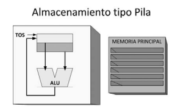
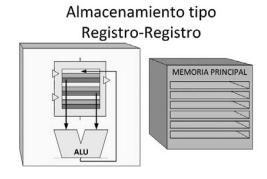
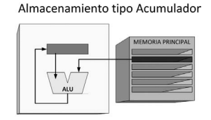
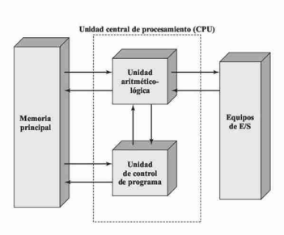

# Informe de Investigación Sobre Arquitectura de Computadoras

Electronica IV - TP - Arquitectura de Computadora

Vega Caro, María Ayelén

## Introducción

Una computadora es una máquina que se encarga de analizar datos de entrada para luego dar un resultado, es decir, se encarga de recibir datos, analizarlos y dar algún resultado. Para poder analizar los datos, la computadora sigue una serie de pasos o comandos (Quiroga, 2010).    
El análisis del funcionamiento de una computadora puede resultar muy complicado, por lo que es importante dividir al sistema en distintos niveles de abstracción.      
El nivel más bajo que podemos encontrar es el nivel molecular, en el cual se encuentran, por ejemplo, los electrones, cuyo comportamiento podemos analizar utilizando las leyes del electromagnetismo.   
Luego tenemos el nivel de dispositivos, aquí se encuentran los distintos dispositivos electrónicos, como podrían ser los diodos o transistores, en donde podemos analizar, por ejemplo, como se relacionan las tensiones y las corrientes en el dispositivo. De esta manera, ya no tenemos que analizar que sucede particularmente con cada electrón (Harris y Harris, 2015).   
En un nivel superior encontramos los circuitos, como podrían ser las compuertas lógicas. Con las compuertas lógicas podemos armar circuitos más complejos, como contadores o registros. Estos últimos pertenecen al nivel lógico. Los circuitos lógicos son los que implementan las distintas operaciones que la computadora debe realizar.      
La microarquitectura relaciona al nivel lógico con la arquitectura. Este nivel involucra la utilización de distintos circuitos lógicos para poder realizar las operaciones definidas por la arquitectura (Harris y Harris, 2015; Murdocca, 2002).      
La arquitectura está relacionada con lo que es visible para el programador, es decir, cómo ve el programador a la computadora. En otras palabras, está relacionada con las instrucciones que la computadora puede ejecutar y los distintos módulos que la componen e incluye los tipos de instrucciones, el tipo de direccionamiento de datos, los tipos de información y las distintas operaciones que se pueden realizar (Morris, 1994; Harris y Harris, 2015; Murdocca, 2002).    
Luego, encontramos el software que maneja la realización de las distintas tareas. Finalmente, encontramos los programas de aplicación, a través de los cuales el usuario se relaciona y/o comunica con la computadora. Aquí están, por ejemplo, los juegos, programas de texto, entre otros.       

## Clases de arquitectura de computadora

Dos tipos de arquitecturas importantes son la arquitectura de Von Neumann y la arquitectura de Harvard. 
La arquitectura de Von Neumann tiene 5 unidades básicas: unidad de entrada, unidad de memoria, unidad aritmética lógica (ALU), unidad de control y unidad de salida. La unidad central de proceso (CPU) es el nombre que se le da al conjunto de la unidad de control y la unidad aritmética lógica.         
La unidad de entrada provee la información e instrucciones necesarias para realizar las distintas tareas, las cuales son guardadas en la unidad de memoria. La unidad aritmética lógica (ALU) realiza distintas operaciones a partir de los datos guardados en la memoria y los resultados de estas operaciones son enviados a la unidad de salida. La unidad de control es la que le da las indicaciones a la unidad aritmética lógica.    
En resumen, la arquitectura de Von Neumann es aquella en la que se utiliza la misma unidad de memoria para almacenar tanto datos como instrucciones y sus módulos básicos son el CPU, las memorias y las unidades de entrada y salida.  
A diferencia de la arquitectura de Von Neumann, en la arquitectura de Harvard se utilizan memorias separadas para almacenar datos e instrucciones (Murdocca, 2002; Quiroga, 2010; Stallings, 2016).   

La máquina de pilas se caracteriza por la estructura en forma de pila que utiliza para el almacenamiento de datos. Una pila es una estructura de almacenamiento de datos, en la que sus elementos se añaden y quitan solo a traves de su parte superior. Se caracteriza por el modo de acceso LIFO (last-in, first-out), en donde el ultimo elemento que se añade es el primero que se quita. En este tipo de maquina los operandos son implicitos (Beltrán y Guzmán, 2010; Aguilar y Martinez, 2002).

 

En cambio, la máquina de registros cuenta con más de un registro donde almacena datos. En este tipo de maquina, los operandos son explícitos y se puede permitir que alguno o todos los operandos esten en la memoria (Beltrán y Guzmán, 2010).

En la máquina de acumulador se utiliza un único registro en donde se guarda el resultado de las operaciones, es decir, utiliza únicamente un acumulador que es un registro de uso general en donde se guardan temporalmente los datos de las operaciones. En este tipo de máquina, el operando que se encuentra en el acumulador es implicito y el otro es explicito (Stallings, 2016; Beltrán y Guzmán, 2010).    

Otros tipos de arquitecturas son la RISC y la CISC.     
En la arquitectura RISC (Reduced Instruction Set Computer) lo que se busca es disminuir el tiempo de ejecución por lo que se simplifican las instrucciones. Una característica de este tipo de arquitectura es que tiene pocas instrucciones y estas instrucciones son simples y fáciles de decodificar. Además, como las instrucciones son más simples, también se hacen más sencillas las operaciones de control. Otra característica es que el formato de las instrucciones no varía.    
En cambio, en la arquitectura CISC (Complex Instruction Set Computer) las instrucciones en lenguaje de programación son mucho más complejas ya que se quiere simplificar la compilación y así mejorar el desempeño de la computadora. A diferencia de la arquitectura RISC, en la arquitectura CISC las instrucciones tienen tamaño variable. En este tipo de arquitectura existen varias maneras de obtener un dato y por eso tiene muchos modos de direccionamiento. Además, suele tener muchas instrucciones y modos de direccionamiento lo que genera que sean necesarios circuitos cada vez más complejos, volviendo los cálculos más lentos (Morris, 1994; Quiroga, 2010; Murdocca, 2002)     

## Partes de una arquitectura de computadora

Una computadora está formada principalmente por:    

-Unidad Central de Procesamiento (CPU) la cual se encarga de procesar los datos y llevar a cabo las distintas operaciones. El CPU, a su vez, está formado por otros componentes como la unidad aritmética lógica (ALU) que se encarga de realizar las operaciones, registros para almacenar datos dentro del CPU y las unidades de control que se encargan de leer los datos almacenados en la memoria y de llevar a cabo distintas instrucciones. También nos solemos referir a esta unidad con el nombre de "procesador". 
-Memoria principal, en donde se almacenan los datos y programas. La memoria de una computadora esta formada por un conjunto de registros los cuales se encuentran numerados y en donde se almacenan los datos.      
-Módulos de entrada y salida (E/S), los cuales se encargan del ingreso y salida de datos, es decir, relaciona a la computadora con el mundo exterior.       
-Bus de datos, que comunica las distintas partes de la computadora. Los buses de datos se encargan de recoger toda la información e instrucciones y de relacionar los distintos módulos (Stallings, 2016; Morris, 1994, Quiroga, 2010). 

## Arquitectura ARM

Una de las arquitecturas más frecuentes o populares para dispositivos embebidos es la arquitectura ARM. Una característica de la arquitectura ARM es que posee una gran cantidad de modos de direccionamiento. Además, se basa en la arquitectura RISC.     
La arquitectura ARMv7-M pertenece a la familia ARM. Este tipo de arquitectura soporta distintos tipos de datos en su memoria, como el byte, la media palabra y la palabra. La arquitectura ARMv7-M se utiliza para aplicaciones en microcontroladores y se destaca por su alto rendimiento (Patterson y Hennessy, 2014; ARM, 2017).      
La arquitectura ARMv7-M es una máquina de registros, puesto que cuenta con numerosos registros que sirven para realizar distintas operaciones, es decir, las operaciones se realizan por medio del uso de registros en lugar de trabajar de manera directa con la memoria principal. Además, se puede clasificar dentro del tipo de arquitectura RISC, de donde proviene su nombre ("Advanced Risc Machine"). 
La implementacion fisica (microarquitectura) de la arquitectura ARMv7-M es de tipo Harvard modificada, donde los buses de datos y programa estan separados a pesar de que los datos y programas se encuentran almacenados en la misma memoria. Sin embargo, la logica que utiliza corresponde a la arquitectura Von Neumann.

## Conclusiones

En base a lo discutido anteriormente, podemos concluir que la arquitectura de computadoras está relacionada con el diseño interno y el funcionamiento de la computadora, es decir, con los distintos módulos que la componen, las instrucciones que ejecuta y como interactúan con el software. Si descomponemos la computadora en distintos niveles, la arquitectura ocuparía uno de los niveles superiores, ya que, como se explicó anteriormente, este concepto no está relacionado al diseño circuital o a las características físicas de la computadora. La arquitectura de computadora cumple un papel fundamental en la creacion de un modelo que le permite al programador comprender el funcionamiento de la computadora sin necesidad de conocer su implementacion fisica, ademas de que permite definir cómo interactuan el hardware y el software.
Por lo tanto, a la hora de elegir un determinado tipo de arquitectura deberíamos tener en cuenta la complejidad de las operaciones a realizar y la rapidez con las que debe ejecutarlas, el costo del hardware y otros elementos asociados, la compatibilidad con el software existente y demás entornos a usar, el rendimiento y el tipo de aplicación que se le dará al sistema.

## Bibliografía

1. ARM. (2017). ARMv7-M Architecture Reference Manual. 
2. Harris, S. L., & Harris, D. (2015). Digital Design and Computer Architecture. Morgan Kaufmann.    
3. Patterson, D. A., & Hennessy, J. L. (2014). Computer Organization and Design: The Hardware/Software Interface. Morgan Kaufmann.    
4. Morris Mano, M. (1994). Arquitectura de Computadoras. Pearson Educación.    
5. Murdocca, M., & Heuring, V. P. (2002). Principios de Arquitectura de Computadoras. Pearson Educación.   
6. Quiroga, I. P. (2010). Arquitectura de Computadoras. Alfaomega.     
7. Stallings, W. (2016). Computer Organization and Architecture: Designing for Performance. Pearson.  
8. Beltrán, M., Guzmán A. (2010). Diseño y Evaluación de Arquitecturas de Computadoras. Pearson Pretince Hall.
9. Luis Joyanes Aguilar, Ignacio Zahonero Martinez (2002). Programación en C
